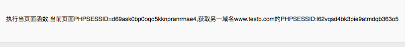
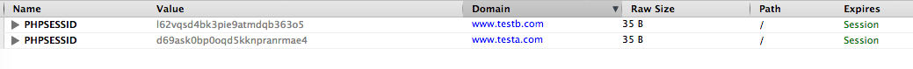
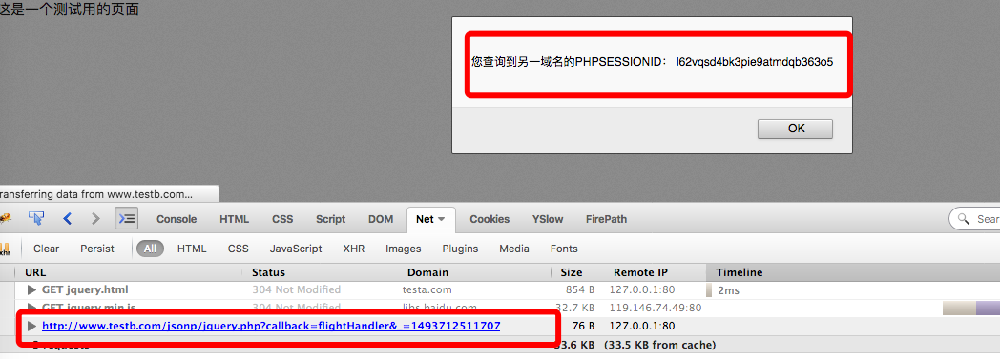

### JSONP详解
  很多人以为JSONP是跟JSON相关的一门技术，连百度百科的开篇也是这么介绍的（“JSONP(JSON with Padding)是JSON的一种“使用模式”）, 但实质上JSONP跟JSON没有任何的关系。JSON是一种数据格式，而JSONP是一种远程动态JS文件调用及执行方式，完全不是同一个东西。
  
  JSONP为解决跨域数据请求而生的，由于浏览器同源策略安全限制，是不允许不同域名间的Cookie共享的，而<scipt></scipt>标签方式的JS文件引入则不受限制，于是乎就有了通过这种方式变通来实现将另一域名的数据引入到当前域名。当然这种Cookie共享的方式需要借助浏览器来实现中转，而不由服务端独立完成。
  
  所以我们可以简单地说JSONP是通过引用脚本文件，来实现将另一域名的COOKIE传递给当前域名，并触发JS脚本程序，最终实现跨域登陆或跨域数据获取。从另一个角度讲，我们可以把JSONP称之为合法的XSS攻击。

### JSONP原生态实现
下面通过一个简单的例子来看下JSONP是如何实现的。
首先需要准备两个测试用的域名，我这里在本地配置了：

1. www.testa.com
2. www.testb.com

两个域名，可以都指向同一目录，个人使用Nginx+Fpm实现

http://www.testa.com/jsonp/index.html

页面代码如下：

`
<!DOCTYPE html>
<html lang="en">
<head>
    <meta charset="UTF-8">
    <title>这是一个测试的页面</title>
   

</head>
<body>
这是一个测试用的页面
</body>
</html>
`

它引用了远程JS代码，一般情况下的JS引入是静态的JS文件，但此处为了获取另外一个域名的Cookie及信息，故需要引入动态文件 ，JS代码由动态文件生成。

http://www.testb.com/jsonp/jsonp.php
代码如下：

`<?php
/**
 * Created by PhpStorm.
 * User: xiaogangyang
 * Date: 2017/5/2
 * Time: 11:00
 */
session_start();
$session_id = session_id();
echo "localMsg('{$session_id}')";
`

刷新页面：http://www.testa.com/jsonp/index.html
可以得到如下结果：

由此可见通过这种方式，我们可以很轻松地实现跨域Cookie信息的获取。

### JSONP在Jquery中的实现方式
Jquery同样提供了JSONP的实现方式，目前可以通过如下三种方式实现：

1. $.ajax
1. $.getJSON
1. $.get

**$.ajax方式**

http://www.testa.com/jsonp/jquery.html:

` 
    `

http://www.testb.com/jsonp/jquery.php

`session_start();
$session_id = session_id();
$data = json_encode(['cookieId'=>$session_id]);
$callback = isset($_GET['callback']) ? $_GET['callback'] : false;
echo $callback ? "$callback({$data})" : '';
`

通过火狐浏览器firebug工具我们可以看到：

jquery.html页面引入：
http://www.testb.com/jsonp/jquery.php?callback=flightHandler&_=1493712511707
页面，这个页面输出的JS语句为：

`
flightHandler({"cookieId":"l62vqsd4bk3pie9atmdqb363o5"})
`

根据Jquery手册我们可以得知，Jquery在使用$.getJSON方式实现JSONP时会，调用对URL进行拼装，将jsonp及jsonpCallback两个变量的及以callback=flightHandler格式传递给服务端，以指导服务端的JS代码应该执行哪一个函数。

**$.getJSON方式**

服务端代码一样，前端代码如下：

`

    
`
与上一种方式不同，如要实现跨域调用，此种方式必须在URL中提供callback=?参数，其中callback可变.

**$.get方式**
服务端代码一样，前端代码如下：

`

     
`
同getJSON，必须在请求的URL里增加callback=?才能实现跨域的调用。

### JSONP的应用

既然JSONP是用来实现跨域数据调用的，那一般情况下是用来解决单点登陆的问题，具体JSONP在单点登陆的具体实现，将在另外的文章里详细介绍，此处不再细说。

#### 单点登陆，具体可以参照其它文件的单点登陆解决方案。

