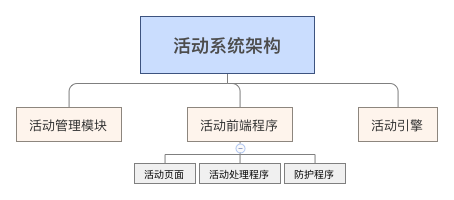
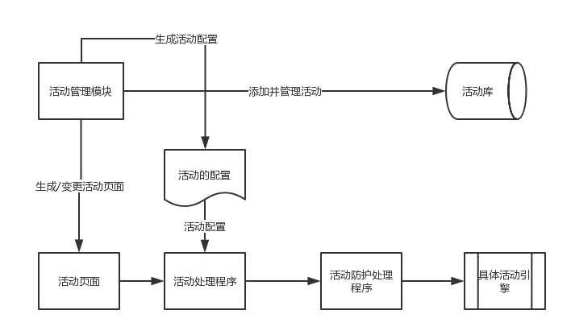
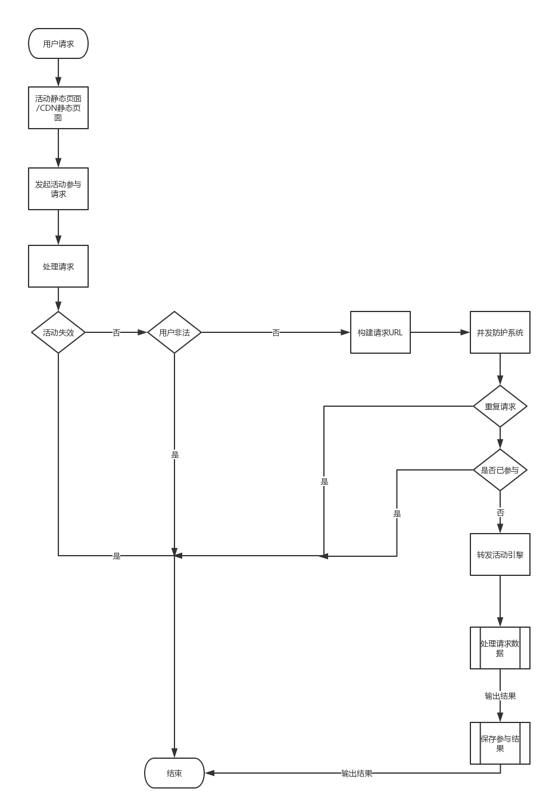

# 活动系统架构设计

## 一、系统设计基本要求

* 活动页面静态化，静态资源CDN化，甚至静态页面也是CDN化，用户查看活动页面时不需要请求到后端服务；
* 活动引擎化，可配置化，具体的活动，设计具体的引擎服务，如红包发送活动，则需要设计一个红包活动引擎，并支持可配置化，服务化驱动化，活动引擎只处理具体请求及业务逻辑，不显示页面；
* 活动系统只负责展示活动，不负责处理具体活动业务逻辑，由具体活动引擎（接口）实现实际所有功能，即活动系统将用户请求分发至具体的活动引擎接口，从而实现最终的活动处理；
* 活动异步处理，活动的请求异步分发至具体的活动引擎接口，而不是同步请求，以避免高并发而造成的堵塞；
* 活动页面模块化，以实现不同的页面的组合；
* 活动自动化测试

## 二、系统模块

活动系统分为前台、后台、活动引擎三大模块，前台负责显示活动页面，处理用户请求，活动引擎处理具体的活动逻辑，后台负责活动管理与配置。

### （一） 活动功能管理模块

* 活动管理：包括活动添加、基本规则设置、上线、下线，活动监控等；
* 静态资源打包上传工具： 将活动所需要的静态资源，打包上传至相关的静态资源目录，而不需要运维来上线。同时提供静态资源检测功能，检测所上传的文件是否都存在；
* 活动页面模块化管理： 可通过添加HTML代码，实现对活动页面的基本编辑，而不是通过上线来实现活动页面的管理；
* 活动页面渲染工具，及静态生成工具： 通过对活动页面渲染来实现页面的静态化，并通过文件生成工具，生成具体的活动页面文件；
* 活动规则设置： 通过调用活动引擎的规则服务，实现对活动具体规则的配置，如同一账号可以获取多少红包的配置等；
* 活动配置化生成功能： 活动的所有相关信息，应该生成具体的配置文件，包括但不限于：生成活动的名称，活动的开始时间，结束时间，活动的存储引擎名，活动分发的接口等 都生成到具体的配置文件中，由活动程序直接引入，不再需要查询数据库；
* 活动预览功能： 通过预览活动页面，查看活动效果；
* 活动检测工具： 
  * 包括活动页面元素检测功能，检查活动页面是否有相应的表单元素，从而 实现初步的活动判断；
  * 模拟请求数据： 通过构建测试请求，来检测活动功能是否OK. 
* 活动监控与统计，通过简单的活动数据统计，来查看活动的效果，如活动的参与人员，活动奖品的分布比例等；
* 活动引擎管理
   * 活动具体实现的驱动程序或服务；
   * 活动的接口地址；
   * 活动的规则说明；
   
### （二） 前台活动处理程序模块
活动处理程序包括，显示活动页面，处理用户参与活动的请求，判断活动是否有效，提供用户请求并发防护等功能
 
* 活动页面显示功能，显示活动页面；
* 用户是否登陆的检测功能，对于某些活动需要登陆的，可以活动此功能实现判断；
* 用户信息获接口： 当前端页面需要获取用户信息等动态信息时，均通过Ajax异步获取 
* 用户是否已经参与活动的接口；
* 活动请求分发工具： 将用户的请求分发至具体的活动引擎，获取活动参与结果，并将结果入库；
* 用户请求防护服务： 防止用户重复请求，从而把系统刷挂，导致其它人无法参与活动; 
* 用户活动参与结果信息显示；

### （三） 活动引擎程序

活动引擎是具体活动的处理程序，如红包的发放，秒杀活动处理， 优惠券的发放等，活动引擎属于活动的最后一层，是最终活动业务的执行方，是直接操作数据库的，故需要在防护程序后面，不然会因为大量的并发而导致程序崩溃，甚至数据错乱。

活动引擎虽然是处理具体的活动业务，但依然需要通用化设计 ，即支持配置化的活动，而不是只局限于一种活动。如抽奖的活动程序，就需要支持奖品的配置，奖品发送比例的配置等，从而实现抽奖程序的通用化。 同样的奖券发送程序也需要支持通用化，支持多少奖券。满足各种需求。

## 三、活动系统流程图

  
## 四、数据库设计

1. 活动表：活动的名称，活动的时间范围，活动的类型，活动引擎，活动的地址，活动的状态，活动的效果等；
2. 活动引擎表：活动的引擎名称，服务的地址，服务的接口.
3. 活动用户参与表： 用户信息、参与活动ID，参与活动时间，参与结果
4. 各种具体活动的数据库设计 ，如奖券表设计， 奖品表设计 ， 签到表设计等。

## 五、红包发放活动示例

红包发送是微信红包出现后，最常见的拉新手段。红包的发放都是在后端服务进行控制。

红包的发放，主要就是要避免并发给后端程序造成压力。故需要做好前端请求的防护。

#### 红包活动引擎设计
红包的发送，分固定发送，或随机发送，考虑到拉新活动的特性，一般都是固定发送。故红包引擎的设计比较简单，只要简单一个红包生成金额控制及红包发送事务控制即可。来一个用户请求，即生成一个红包，并入库，入库前需要检查红包是否存在，存在则不入库。

#### 红包活动管理流程：

1. 配置红包引擎，设置红包服务的地址等；
2. 红包活动的管理，设置红包活动名称，红包的数据，红包的发放比例，红包的
通过后台管理页面，配置活动的名称，活动的文案说明，活动页面设计；
3. 生成活动页面；
4. 通过检测程序，检查活动页面是否合法，活动页面是否有效；
5. 推广活动页面，导流；

#### 活动的前台流程
活动的前台页面，可以直接通过CDN缓存，用户的请求不会直接到达后端服务，红包页面可以不检测用户的登陆状态，通过用户的手机号来实现发放。

红包的前台流程如下

1. 用户请求CDN红包页面；
2. 填写手机号；
3. 活动程序接收用户请求，发送至并发及重复防护程序，检测是否重复并发，重复并发，则返回处理中；
4. 检测用户用户否参与过活动，已参与直接返回；
4. 活动程序将未参与的请求分发至活动处理引擎，实现最终结果；
5. 获取参与结果，并登记入库，返回操作结果。

  

